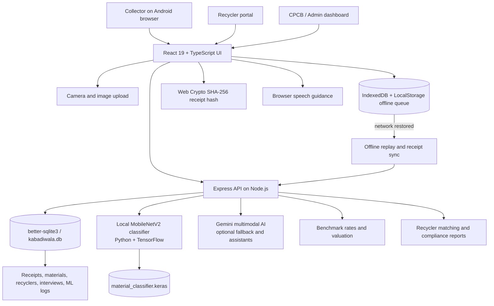

# Kabadiwala Connect

### A practical digital bridge from informal collection to authorized e-waste recycling

Kabadiwala Connect is a vernacular, offline-tolerant platform for informal scrap collectors, aggregators, and authorized recyclers. It makes the formal route easier to choose by combining price transparency, image-assisted material identification, recycler discovery, traceable handover records, payment history, and safety guidance in one field-oriented workflow.

The product is designed for the reality of a scrap shed: intermittent connectivity, entry-level Android hardware, mixed material lots, cash payments, and users who should not have to navigate a compliance portal to receive a fair price.

## Why this matters

India's informal collectors provide the last-mile reach of the e-waste economy, but often lack direct access to authorized recyclers, reliable rates, verifiable handover records, and safe processing guidance. That information and institutional gap creates room for underpayment, undocumented transactions, unsafe cable burning, acid leaching, and hazardous battery or CRT handling.

Kabadiwala Connect changes the decision at the point of collection:

```text
Photo + approximate weight
        -> transparent benchmark
        -> suitable authorized recycler
        -> documented handover
        -> payment and traceability record
```

## Product surface

| Surface | What it enables |
| --- | --- |
| **Snap & Estimate** | Photograph or upload a lot, classify material, enter weight, and estimate value. |
| **Price Guide** | Compare benchmark rate, fair range, seven-day trend, and a buyer's offer. |
| **Best Price Auction** | Simulate competing recycler bids for a lot. |
| **Find Recyclers** | Filter facilities by accepted material, distance, rating, authorization, and pickup. |
| **Digital Ledger** | Review receipts, payment status, manifest reference, GPS, and QR hash. |
| **Offline Queue** | Capture lots without connectivity and replay them when the network returns. |
| **Safety Guide** | Provide visual, multilingual, and spoken guidance for batteries, CRTs, cables, and hazardous handling. |
| **Recycler Portal** | Review inflow, payouts, EPR credits, CPCB-oriented reports, and fraud checks. |
| **Admin + Field Research** | Inspect datasets, validation runs, field records, and anomaly workflows. |

The interface supports English, Hindi, and Marathi, uses large touch targets, and keeps cash payment available. Digital payment is represented in the record but is not a prerequisite for using the platform.

## Architecture



### Runtime flow

1. The collector captures a photo and approximate weight.
2. Snap & Estimate calls the local trained classifier first when the model artifact is installed.
3. The classifier returns a category and confidence; the application combines the category with its benchmark price table.
4. Gemini remains available as a fallback for richer multimodal analysis, price reasoning, WhatsApp assistance, and safety advice.
5. Offline lots are stored locally, then replayed to `POST /api/receipts` when connectivity returns.
6. Receipt data is hashed, persisted in SQLite, and surfaced in the earnings ledger and recycler views.

The model identifies a category; it does not independently determine purity, final payment, safety clearance, or regulatory compliance. Those require verification.

## Trained ML model

The repository contains a real transfer-learning experiment, not an augmented copy of one image per class.

- **Backbone:** MobileNetV2 pretrained on ImageNet
- **Training:** frozen feature extractor followed by low-learning-rate fine-tuning of the final 30 backbone layers
- **Augmentation:** horizontal flip, rotation, zoom, and contrast applied only to training data
- **Dataset:** Kaggle E Waste Image Dataset, Apache 2.0 as listed on Kaggle
- **Split:** dataset-provided train, validation, and held-out test folders
- **Classes:** Battery, Keyboard, Microwave, Mobile, Mouse, PCB, Player, Printer, Television, Washing Machine
- **Images:** 2,400 train, 300 validation, 300 test

| Held-out test metric | Result |
| --- | ---: |
| Accuracy | **94.33%** |
| Macro precision | **94.63%** |
| Macro recall | **94.33%** |
| Macro F1 | **94.18%** |

Artifacts and evidence:

- [Training script](ml/train_material_model.py)
- [Inference script](ml/predict_material.py)
- [Training report](ml/artifacts/training_report.json)
- [Dataset and license provenance](ml/SOURCES.md)

These metrics describe performance on the published Kaggle test set. They are not a claim of accuracy on informal-sector photographs, Indian scrap-shed lighting, damaged material, or unseen device cameras. The system should use confidence thresholds and human verification before financial or safety decisions.

## Datasets and persistence

The application uses structured records rather than treating data as a static list.

- **Materials:** category, descriptions, benchmark/min/max prices, hazard, recoverable metals, and price history.
- **Prices:** material, unit, benchmark range, historical observations, and recycler context. The current values are seeded prototype benchmarks, not a live market feed.
- **Recyclers:** facility, location, accepted materials, CPCB reference, contact details, pickup threshold, service area, and bonus rate.
- **Transactions:** lot ID, collector, material, weight, quote, final price, recycler, timestamps, GPS, payment state, and transaction state.
- **Traceability:** photograph reference, manifest number, handover details, QR verification hash, and subsequent status.
- **Collectors:** minimal profile, preferred language, operating location, transaction history, and earnings history.
- **ML validation:** sample size, accuracy, failure modes, methodology, and per-sample predictions.

SQLite tables are initialized in [src/server/db.ts](src/server/db.ts). The frontend also contains clearly labeled demo seed data in [src/data/mockData.ts](src/data/mockData.ts); production deployment should consolidate these sources behind the API.

## API surface

| Endpoint | Purpose |
| --- | --- |
| `GET /api/materials` | Read persistent material records. |
| `GET /api/prices` | Read benchmark price index. |
| `GET /api/recyclers` | Filter authorized recycler records. |
| `GET/POST /api/receipts` | Read and persist digital receipts. |
| `GET/POST /api/field-interviews` | Read and persist field research records. |
| `GET/POST /api/ml-validation` | Read validation history and run labeled Gemini benchmarks. |
| `POST /api/ml/predict-material` | Run the locally trained TensorFlow classifier. |
| `POST /api/ai/detect-material` | Gemini image classification fallback. |
| `POST /api/ai/predict-price` | AI price sanity check and counter-offer. |
| `POST /api/ai/match-recyclers` | Rank recycler options and estimate payout. |
| `POST /api/ai/detect-fraud` | Flag abnormal or inconsistent transactions. |
| `POST /api/recycler/generate-compliance-report` | Generate CPCB-oriented report data. |
| `POST /api/ai/whatsapp-chat` | Multilingual scrap assistant. |
| `POST /api/ai/safety-advice` | Multilingual hazard and PPE guidance. |

## Run locally

### Requirements

- Node.js 22.5+
- npm 10+
- Python 3.11+
- TensorFlow and scikit-learn for local ML inference/training
- `GEMINI_API_KEY` only for Gemini-backed features

```bash
npm install
npm run dev
```

Open [http://localhost:3000](http://localhost:3000).

The folder name contains `&`, which can break npm's Windows-generated executable wrappers. When that happens, use:

```powershell
node .\node_modules\typescript\bin\tsc --noEmit
node .\node_modules\vite\bin\vite.js build
```

### Train or retrain

The downloaded Kaggle dataset is already arranged at `ml/dataset/kaggle/modified-dataset`.

```bash
python ml/train_material_model.py
```

For a new dataset, use this structure:

```text
ml/dataset/
  train/<class-name>/*.jpg
  val/<class-name>/*.jpg
  test/<class-name>/*.jpg
```

The trainer requires at least 30 images per class and emits a model plus metrics report. Keep source, consent, class definitions, and split strategy in [ml/SOURCES.md](ml/SOURCES.md).

## Demonstration path

1. Sign in with a clearly labeled demo account.
2. Open **Snap & Estimate** and upload a material image.
3. Show the local model category and confidence, then enter approximate weight.
4. Compare the benchmark and historical trend in **Price Guide**.
5. Open **Find Recyclers** and show facility filtering.
6. Enable offline mode and queue a lot.
7. Restore connectivity and demonstrate replay into the receipt ledger.
8. Open the receipt hash audit and show that changing weight changes the digest.
9. Switch to **Recycler** for compliance and inflow views.
10. Switch to **Admin** for ML validation and dataset evidence.

## Responsible-use boundaries

This is a working prototype and research demonstration. Before operational deployment it needs:

- Consent-based field collection from at least two working collectors or aggregators.
- Independently verified recycler authorization and an update process.
- Real price observations with source, timestamp, location, and quality status.
- Field photographs across lighting, devices, conditions, and material mixtures.
- Collector/facility-aware test splits to prevent image leakage.
- Production authentication, authorization, payment reconciliation, and audit controls.
- Safety and regulatory review before any automated recommendation is treated as authoritative.

Seeded people, prices, facilities, license references, field records, and locations are illustrative unless independently verified.

## License and dataset attribution

The application code is released under the [MIT License](LICENSE). Dataset licensing and source decisions are documented in [ml/SOURCES.md](ml/SOURCES.md). Commercial stock-photo sources without clear machine-learning training rights are not included in the training set.
